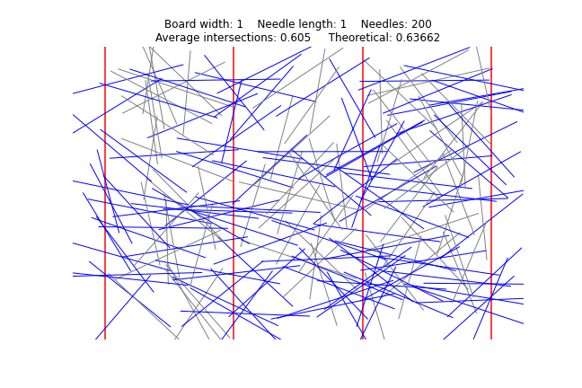
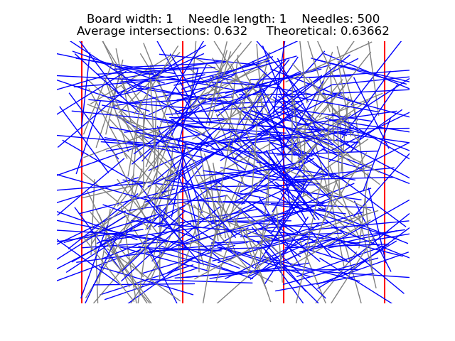
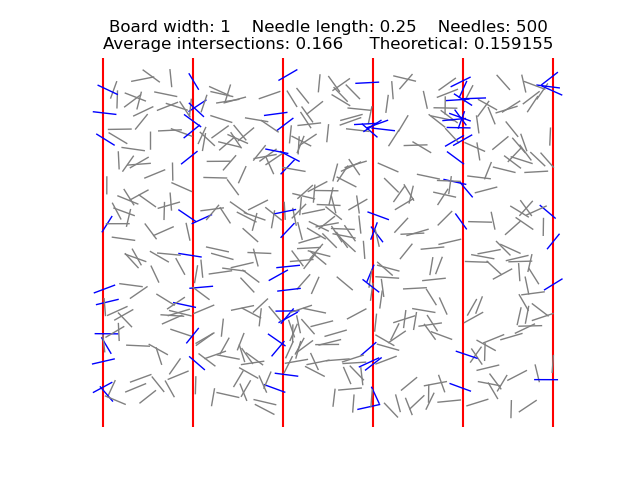

# Teaching Demonstrations
Simulations, mostly probability but also linear algebra, I've used while teaching
Usually run inside a Python IDE (eg Spyder)

## [`AirplaneSeat.py`](AirplaneSeat.py)
Simulation of a [relatively famous probability word problem](https://www3.nd.edu/~dgalvin1/Probpuz/probpuz3.html). "One hundred people line up to board a plane with 100 seats. The first person in line is has lost his boarding pass, so he randomly chooses a seat. After that, each person entering the plane either sits in their assigned seat, if it is available, or, if not, chooses an unoccupied seat randomly.  When the 100th passenger finally enters the plane, what is the probability that she finds her assigned seat unoccupied?"  The simulation also displays what happens with intermediate passengers, as their probabilities behave much differently from the first and last passenger (a common source of incorrect reasoning about the problem).  Here's one random simulation with 10 passengers: Person 1 chose the seat for Person 7, then Person 2 chose the seat for Person 2, ... Person 7 chose the seat for Person 1, etc.
```
>>> airplane_seat_simulation(10)
[(1, 7), (2, 2), (3, 3), (4, 4), (5, 5), (6, 6), (7, 1), (8, 8), (9, 9), (10, 10)]
```
Considering the problem with 100 passengers and running the simulation 1000 times, we see that the 2nd to last passenger got the correct seat 66.4% of the time, and final passenger got the correct seat 49.8% of the time.
```
>>> l = airplane_simulation_statistics(num_trials=1000, num_passengers=100);
>>> l[-2], l[-1]
(0.664, 0.498)
```

## [`BuffonNeedle.py`](BuffonNeedle.py)
Simulation of [Buffon's Needle Problem](https://en.wikipedia.org/wiki/Buffon's_needle_problem).  Parameters can be easily adjusted, and the resulting images can be saved.

  

## [`ConditionalProbBoyGirl.py`](ConditionalProbBoyGirl.py`)
One of the first non-intuitive problems you see in conditional probability is some variant of the [Boy or Girl Paradox](https://en.wikipedia.org/wiki/Boy_or_Girl_paradox).  For example, assume a family has two children (the Boy/Girl gender of each is independent and has 50/50 probability).   This script generates a bunch of random examples and *very explicitly* calculates the relevant quantities to the answer the following:
```
Probability that both are girls if the eldest is a girl: 0.5019988007195683
Probability that the youngest is a girl if there is at least one girl: 0.668657073702689
Probability that both are girls if there is at least one girl: 0.3340027129824188
```
The code is intended to be able to be read aloud and explained to students with no programming experience.

## [`PalindromeNumbers.py`](PalindromeNumbers.py)
This one is especially fun to do with children who are learning long addition.  There's an interesting unsolved conjecture (see [Lychrel number](https://en.wikipedia.org/wiki/Lychrel_number)) about whether a 'reverse and add' process will always result in a palindrome number.  For example, 57 becomes a palindrome after two iterations: 57+75 = 132, 132+231 = 363.
```
>>> palindrome_sequence(57)
[57, 132, 363]
```
It is conjectured that some numbers will never become palindromic through this procedure, but (for base 10) there is no proof.  The smallest candidate for such a number is 196, and here are the first 10 numbers in the sequence.
```
>>> palindrome_sequence(196, stop_length=10)
[196, 887, 1675, 7436, 13783, 52514, 94039, 187088, 1067869, 10755470]
```
